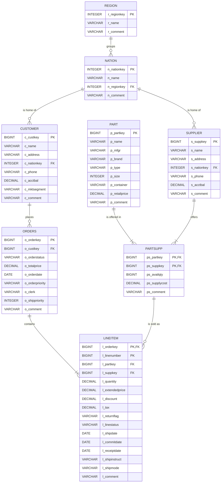

# Data model

The dataset is the TPC-H benchmark schema.

It models a wholesale supplier: **customers** place **orders** made of **line items**; each line item ships one **part** from one **supplier**; customers and suppliers belong to a **nation**, which belongs to a **region**.

## Entity relationship diagram

